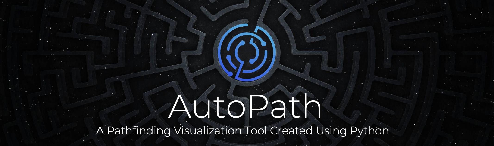

  

   
   

  
  [![Contributors][contributors-shield]][contributors-url]
  [![Last Commit][last-commit-shield]][last-commit-url]
  [![Issues][issues-shield]][issues-url]
  [![MIT License][license-shield]][license-url]
  
  <a href="https://github.com/comp195/senior-project-spring-2022-autopath/tree/master/documentation"><strong>Explore the docs »</strong></a>
  

<!-- TABLE OF CONTENTS -->

  
Table of Contents

- [About The Project](#about-the-projec)
    - [Built With](#built-with)
  - [Getting Started](#getting-started)
  - [Roadmap](#roadmap)
  - [License](#license)
  - [Contact](#contact)
  - [Acknowledgments](#acknowledgments)

<!-- ABOUT THE PROJECT -->
## About The Project

![demo][demo]

AutoPath is an application that visualizes pathfinding algorithms in real time. Users have the ability to choose from a randomly generated maze, maze presets, or simply build what they want. AutoPath allows users to choose from algorithms such as Greedy Best-First Search, Dijkstra’s Algorithm, A* Search, Breadth-First Search, and Depth-First Search and visualize how the algorithm finds the path from a selected start point to a selected end point.

(<a href="#top">back to top</a>)

### Built With
- 
- PyQt5

(<a href="#top">back to top</a>)

<!-- GETTING STARTED -->
## Getting Started

Instructions available upon request.
   

(<a href="#top">back to top</a>)

<!-- ROADMAP -->
## Roadmap
- [x] Create a 2D grid
- [x] Add ability for users to add their own start and stop locations
- [x] Add ability for users to add their nodes and walls
- [x] Develop random maze generation
- [x] Enable pathfinding visualization for Djikstra
- [ ] Enable pathfinding visualization for A*
- [ ] Enable pathfinding visualization for BFS
- [ ] Enable pathfinding visualization for DFS

See the [open issues](https://github.com/github_username/repo_name/issues) for a full list of proposed features (and known issues).

(<a href="#top">back to top</a>)

                                
<!-- LICENSE -->
## License

Distributed under the MIT License. See `LICENSE.txt` for more information.

(<a href="#top">back to top</a>)

                                
<!-- CONTACT -->
## Contact

  [![LinkedIn][linkedin-shield-bikram]][linkedin-url-bikram]

Bikram Chatterjee - b_chatterjee@u.pacific.edu

(<a href="#top">back to top</a>)

(<a href="#top">back to top</a>)

                                
<!-- ACKNOWLEDGMENTS -->
## Acknowledgments

* [A* Pathfinding - Aron Granberg](https://arongranberg.com/astar/)
* [AI Pathfinding - Unity](https://www.youtube.com/watch?v=TsB_6yjACDY)
* [Breadth First Search](https://www.geeksforgeeks.org/breadth-first-search-or-bfs-for-a-graph/)    
* [Depth First Search](https://www.geeksforgeeks.org/depth-first-search-or-dfs-for-a-graph/)

(<a href="#top">back to top</a>)

      
    Made with ❤️ by i0nics

[contributors-shield]: https://img.shields.io/github/contributors/i0nics/autopath-python.svg?style=for-the-badge
[contributors-url]: https://github.com/i0nics/autopath-python/graphs/contributors
[demo]: media/autopath-demo.gif
[issues-shield]: https://img.shields.io/github/issues/i0nics/autopath-python.svg?style=for-the-badge
[issues-url]: https://github.com/i0nics/autopath-python/issues
[last-commit-shield]: https://img.shields.io/github/last-commit/i0nics/autopath-python?style=for-the-badge
[last-commit-url]: https://img.shields.io/github/last-commit/i0nics/autopath-python?style=for-the-badge
[license-shield]: https://img.shields.io/github/license/i0nics/autopath-python.svg?style=for-the-badge
[license-url]: https://github.com/i0nics/autopath-python/blob/master/LICENSE.txt
[linkedin-shield-bikram]: https://img.shields.io/badge/-LinkedIn_(Bikram_C.)-black.svg?style=for-the-badge&logo=linkedin&colorB=555
[linkedin-url-bikram]: https://linkedin.com/in/bikramce
[product-screenshot]: images/screenshot.png 
